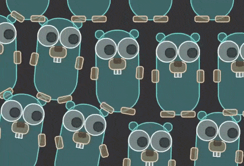

# dbox2d

[](https://github.com/dhannyell/dbox2d/actions/workflows/test.yml)
[](https://pkg.go.dev/github.com/dhannyell/dbox2d)
[](https://github.com/dhannyell/dbox2d/tags)
[](LICENSE)
[](go.mod)

Deterministic 2D physics for Go.

`dbox2d` is a Go port of [Box2D](https://box2d.org) v3.1.1. It offers two
scalar modes from the same solver: `float32` is the default, and
`-tags dbox2d_fixed` selects Q32.32 fixed-point arithmetic. Both modes are
deterministic; the difference in their reproducibility contracts is described
in [Scalar modes and determinism](#scalar-modes-and-determinism).

**[](https://dhannyell.github.io/dbox2d/)**

[Open the live demo](https://dhannyell.github.io/dbox2d/) · [float mode](https://dhannyell.github.io/dbox2d/?mode=float) · [fixed mode](https://dhannyell.github.io/dbox2d/?mode=fixed)

The browser demo requires WebGPU and run on a single thread due to limitations in Go's WebAssembly implementation. To use multithreading, try the native version. see [the samples](samples/README.md).

## Highlights

- Box2D v3.1.1's public API, expressed in Go style.
- Deterministic results and a checksum over the complete world state.
- Bodies, shapes, sensors, chains, contacts, seven joint types, queries,
  casts, continuous collision, events, and debug drawing.
- Native and WebAssembly samples rendered with WebGPU.
- Optional SIMD contact solving with scalar-parity checks.

## Install

Requires Go 1.26.4 or newer.

```sh
go get github.com/dhannyell/dbox2d
```

The API follows Box2D closely. A reference function such as
`b2Body_GetPosition(bodyId)` becomes `bodyId.GetPosition()`; constructors,
defaults, and geometry helpers remain package functions.

## First world

```go
package main

import "github.com/dhannyell/dbox2d"

func main() {
	def := dbox2d.DefaultWorldDef()
	def.Gravity = dbox2d.Vec2{Y: dbox2d.QFromInt(-10)}
	world := dbox2d.CreateWorld(&def)
	defer dbox2d.DestroyWorld(world)

	world.Step(dbox2d.QFromRatio(1, 60), 4)
}
```

Use `QFromInt`, `QFromRatio`, `QFromFloat64`, or `QMustParse` to create values
that are rounded consistently by the selected scalar mode.

## Run the samples

The `samples` module includes the Box2D scenes in native and WebAssembly
hosts. Native runs need cgo, a C toolchain, and a Vulkan, Metal, or D3D12
driver. The browser host needs WebGPU.

```sh
cd samples
go run ./cmd/native
```

To build the browser host:

```sh
cd samples
CGO_ENABLED=0 GOOS=js GOARCH=wasm go build -o web/app.wasm ./cmd/web
GOTOOLCHAIN=go1.27.0 GOEXPERIMENT=simd CGO_ENABLED=0 GOOS=js GOARCH=wasm go build -tags dbox2d_simd -o web/app.wasm ./cmd/web
go run ./cmd/serve
```

Then open `http://localhost:8080`. The full list of controls, platform
requirements, and instructions for adding a scene are in
[samples/README.md](samples/README.md).

## Scalar modes and determinism

Both modes are deterministic, but they are different numeric systems and can
follow different trajectories. `ScalarMode` reports the active mode.

| Build | Arithmetic | Best for |
| --- | --- | --- |
| default | `float32` | General use, multiplayer, rollback, and authoritative simulation with a controlled build matrix |
| `-tags dbox2d_fixed` | Signed Q32.32 fixed point | A stronger cross-platform reproducibility contract |

Float is deterministic for a specific supported build and target. A silently
introduced fused multiply-add (FMA), compiler change, or other floating-point
variation can make two peers take different paths while each continues to
produce internally valid results. For float rollback, lockstep, or
authoritative simulation, pin the toolchain and flags, validate every supported
target, keep update order and random state stable, and compare checksums
regularly.

Fixed point provides a stronger and easier-to-audit contract across toolchains
and architectures, but does not make the complete application deterministic by
itself.

Use these constructors to create simulation values:

```go
dbox2d.QZero()
dbox2d.QOne()
dbox2d.QHalf()
dbox2d.QFromInt(3)
dbox2d.QFromRatio(1, 8)
dbox2d.QFromFloat64(0.35)
dbox2d.QMustParse("0.35")
```

`QFromFloat64` rounds to the nearest scalar of the mode, the same way on every
architecture, and `QToFloat64` converts back. A constant converts to the same
bits everywhere. A `float64` computed at run time is only as deterministic as
its computation: Go fuses a multiply and an add into one rounding on arm64,
and on amd64 with `GOAMD64=v3`, so the same expression can give different bits
in different builds.
`QMustParse` rounds a decimal once, while a literal passed to `QFromFloat64`
rounds to `float64` first, so a long literal can differ in the last bit.

Angles in the API are turns in both modes: one quarter turn is
`QFromRatio(1, 4)`, and an angular velocity is in turns per second. Inside,
the body state keeps radians per second, and a joint keeps its angles in
radians in float mode, as Box2D does, and in turns in fixed mode (D-004).

Build and test fixed mode with:

```sh
go build -tags dbox2d_fixed ./...
go test -tags dbox2d_fixed ./...
cd samples
go test -tags dbox2d_fixed ./...
go run -tags dbox2d_fixed ./cmd/native
```

The published sample page serves the float build by default. Add
`?mode=fixed` to load the fixed build instead.

The port is checked against traces of the reference compiled without SIMD and
without FMA; the collision functions match the reference bit for bit in float
mode except at three documented sites, and the fixed mode stays within measured
budgets. See DIVERGENCES.md D-018.

### Reproducing Box2D bit for bit

With `-tags dbox2d_upstream_pairs`, float mode reproduces the output bits of
the reference built without SIMD and without FMA: every frozen scene trace
matches over its full length, in the scalar and the SIMD families alike.

```sh
go test -tags dbox2d_upstream_pairs ./...
```

The tag restores the broadphase pair order of Box2D, which follows the walk of
the tree. The default build sorts those pairs instead, so its world does not
depend on tree topology, and it parts from the reference wherever the two
orders differ (DIVERGENCES.md D-013). CI runs both.

### SIMD

Use `dbox2d_simd` to enable the SIMD contact solver. It is optional and
produces the same result bits as the scalar solver.

| Target | Native path |
| --- | --- |
| amd64 | AVX2, with scalar fallback when AVX2 is unavailable |
| arm64 | NEON |
| wasm and other targets | generic path |

Native vector paths require Go 1.27.0 and `GOEXPERIMENT=simd`:

```sh
GOTOOLCHAIN=go1.27.0 GOEXPERIMENT=simd go build -tags dbox2d_simd ./...
GOTOOLCHAIN=go1.27.0 GOEXPERIMENT=simd go build -tags dbox2d_simd,dbox2d_fixed ./...
```

The generic path is useful for compatibility and conformance; benchmark it
before enabling it for production.

### Workers, callbacks, and drawing

`WorldDef.WorkerCount` controls native workers without changing result bits.
WebAssembly always steps on one worker. Go callbacks use closures rather than
the C API's `void*` context.

`DefaultDebugDraw` provides no-op callbacks. Implement the operations your
host needs and call `worldId.Draw(&draw)`; the library walks the world and the
host decides how to render it.

## Compatibility with Box2D

This is a port, not a new physics design. It preserves the upstream file
structure, names without the `b2` prefix, and order of operations so code can
be compared with its Box2D counterpart.

It does not promise the same output bits as Box2D. Both scalar modes share one
source, and the fixed-point mode forbids some float-oriented operations, so
those operations change in both modes. Each intentional change is documented with
its rationale and test coverage in [DIVERGENCES.md](DIVERGENCES.md).

`dbox2d` is not affiliated with, endorsed by, or supported by the Box2D
project. Please report `dbox2d` issues here rather than upstream.

## Performance

Performance depends on the workload and target. Native SIMD improves
contact-heavy scenes on supported CPUs, while the generic path may be slower
than scalar. Measure both scalar modes and the target that matters to you:

```sh
go test -run "^$" -bench . -benchmem
go test -tags dbox2d_fixed -run "^$" -bench . -benchmem
```

The repository's benchmark results are historical measurements, not a promise
for another machine or scene. The saturation counter used by some tests is
diagnostic only and never changes simulation results.

### Against Box2D

The seven benchmark scenes of the reference run on both sides under one
protocol: the same step counts, the same AVX2 lane path at width 8, fused
multiply-add disabled in the C build because the port never emits it, and
validation off in both. Solver milliseconds are the sum of the per-step
minima, and each figure is a geometric mean over the seven scenes.

| Workers | Port over reference | With PGO | Reference speedup | Port speedup | Reference efficiency | Port efficiency |
| ---: | ---: | ---: | ---: | ---: | ---: | ---: |
| 1 | 1.46x | 1.42x | 1.00x | 1.00x | 100% | 100% |
| 2 | 1.29x | 1.22x | 1.60x | 1.81x | 80% | 91% |
| 4 | 1.34x | 1.26x | 2.77x | 3.02x | 69% | 75% |
| 8 | 1.39x | 1.31x | 4.00x | 4.20x | 50% | 52% |

The port scales better than the reference at every worker count: it keeps
more of its single-thread speed as threads are added, so the gap narrows
from 1.46x on one thread to 1.39x on eight. The per-scene ratios at eight
workers run 1.32x to 1.53x.

The port also lands on the same result bits at every worker count, in all
seven scenes. The reference does so in six; its `rain` hash changes with the
worker count, reproducibly.

Measured on an AMD Ryzen 7 5800X3D, Windows/amd64, sixteen logical cores,
GCC 13.2.0, Go 1.27.0, three repeats.

### Running the comparison

The harness is in the tree, so the numbers above can be checked rather than
taken. The reference is not vendored: clone Box2D v3.1.1 beside this
repository, or pass `-DBOX2D_SOURCE_DIR=<path>`.

```sh
git clone --branch v3.1.1 --depth 1 https://github.com/erincatto/box2d ../box2d
cmake -S tools/cbench -B build/cbench -G Ninja -DCMAKE_BUILD_TYPE=Release
cmake --build build/cbench
```

Run one arm at a time and write a JSON file per worker count:

```sh
mkdir -p testdata/bench
./build/cbench/cbench --want-lane=avx2 --repeats=3 --workers=8 --arm=c-avx2 --out=testdata/bench/c-avx2-w8.json
GOTOOLCHAIN=go1.27.0 GOEXPERIMENT=simd go test -tags dbox2d_simd -run TestSceneBench -timeout 7200s . -bench.arm=go-avx2 -bench.want-lane=avx2 -bench.repeats=3 -bench.workers=8 -bench.out=testdata/bench/go-avx2-w8.json
```

`benchcmp` compares one worker count and `benchscale` a whole sweep. Both
refuse to compare runs that did not share a lane path, a lane width, a clock
or an observed worker count, so a mismatched pair is an error rather than a
misleading ratio:

```sh
go run ./tools/benchcmp testdata/bench/c-avx2-w8.json testdata/bench/go-avx2-w8.json
go run ./tools/benchscale -base=c-avx2 testdata/bench/c-avx2-w*.json testdata/bench/go-avx2-w*.json
```

The protocol, the worker-pool contract, the lane and clock guards, and the
per-scene tables are documented in
[tools/cbench/README.md](tools/cbench/README.md). Results are not tracked in
the repository: one is a single machine on a single day.

### Profile-guided optimization

A profile takes 3 to 6 percent off the solver: 2.7 percent on one worker and
5 to 6 percent from two workers up, in all seven scenes. It changes no result
bits. The checksum witnesses, the conformance traces under
`dbox2d_upstream_pairs`, the no-FMA gate and the per-scene hashes all hold
with a profile applied, because every float product already sits inside an
explicit rounding conversion, and a fused multiply-add cannot cross that
barrier.

Go reads `default.pgo` from the directory of the `main` package, so a library
cannot ship one for you. Collect a profile of your own workload, which is the
one whose hot paths matter:

```sh
go test -run "^$" -bench . -cpuprofile=cpu.pprof
cp cpu.pprof ./cmd/game/default.pgo
go build ./cmd/game
```

A profile kept elsewhere works through the flag, and `-pgo=off` builds without
one:

```sh
go build -pgo=cpu.pprof ./cmd/game
go build -pgo=off ./cmd/game
```

The sample hosts carry a profile of the benchmark scenes, so `go run
./cmd/native` and the WebAssembly build use it with no flag.

## License

MIT. This is a derivative work of Box2D, which is also MIT. See
[LICENSE](LICENSE).
