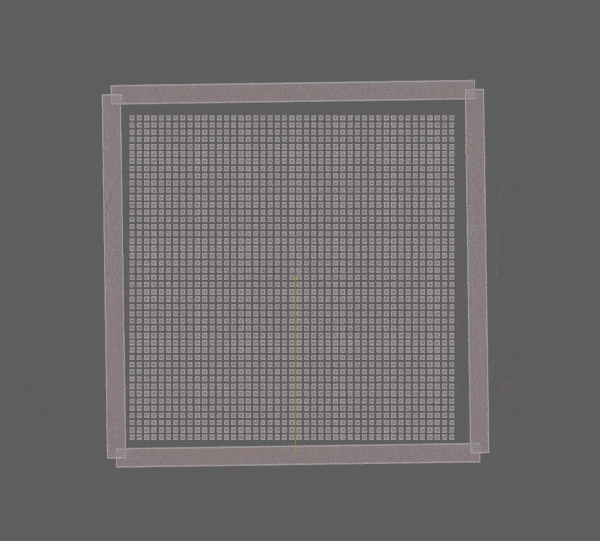

# dbox2d

`dbox2d` is a deterministic 2D physics library for Go and a port of
[Box2D](https://box2d.org) v3.1.1. It has two scalar modes: the default build
uses Q32.32 fixed-point arithmetic, while `-tags dbox2d_float` selects
`float32`. In either mode, equal inputs produce the same result bits on every
supported architecture and on every run.

Fixed point is the safer default for cross-platform rollback, replay, and
authoritative simulation. Float mode is also deterministic on the
architectures covered by this repository's CI, and is usually faster in the
measured workloads. A float-mode application must still control its complete
simulation, not only its physics.

The project is pre-v1. Its public API and import path may change before the
first stable release. It requires Go 1.26.4 or newer.

**[](https://dhannyell.github.io/dbox2d/)**\
**Try the sample scenes in browser: [fixed mode](https://dhannyell.github.io/dbox2d/) · [float mode](https://dhannyell.github.io/dbox2d/?mode=float) (WebGPU required)**

## What is included

The current port includes worlds, bodies, shapes, mass properties, contact
manifolds, distance queries, shape casts, time of impact, sleeping islands,
the constraint graph, the soft-step contact solver, events, dynamic trees,
broadphase queries, chains, sensors, the character mover, and all seven Box2D
joints plus the filter joint.

`WorldId.Step` creates new contact pairs, updates contacts, solves joints and
contacts, handles fast bodies and bullets, and puts resting islands to sleep.
It also exposes step profiling and memory statistics.

[PORTING.md](PORTING.md) records the status of the Box2D port. Read
[DIVERGENCES.md](DIVERGENCES.md) when you need to understand a deliberate
difference from the C implementation.

## Install

```sh
go get github.com/dhannyell/dbox2d
```

The package follows the Box2D API closely. Reference functions named
`b2<Type>_<Name>` normally become methods on the matching ID type:

```go
b2Body_GetPosition(bodyId)              // bodyId.GetPosition()
b2RevoluteJoint_EnableLimit(jointId, x) // jointId.EnableLimit(true)
b2World_GetGravity(worldId)             // worldId.GetGravity()
```

Functions that do not operate on an existing handle remain package functions,
including `Create*`, `Destroy*`, `Default*Def`, `Make*`, and geometry helpers.

## Run the samples

The `samples` module contains 47 Box2D scenes in the Stacking, Benchmark, and
Joints categories. A native host and a browser host render the same scenes with
WebGPU.

```sh
cd samples
go run ./cmd/native
```

To build the browser host:

```sh
cd samples
CGO_ENABLED=0 GOOS=js GOARCH=wasm go build -o web/app.wasm ./cmd/web
go run ./cmd/serve
```

Then open `http://localhost:8080`. The full list of controls, platform
requirements, and instructions for adding a scene are in
[samples/README.md](samples/README.md).

## Determinism and scalar modes

The default build stores simulation values in signed Q32.32 fixed point from
[`fixed`](https://github.com/dhannyell/fixed). The optional `dbox2d_float`
build tag uses `float32` instead. Both modes keep a deterministic result for a
given architecture-supported build, but they are different numeric systems and
can follow different trajectories.

| Build | Scalar type | Determinism promise | When to use it |
| --- | --- | --- | --- |
| default | Q32.32 fixed point | identical Q32.32 bits across supported architectures | authoritative simulation, replay, rollback, and checksums |
| `-tags dbox2d_float` | `float32` | identical float32 bits on amd64, arm64, 386, and wasm | comparison work and float-mode sample builds |

Use the package constructors to create simulation values:

```go
QZero()
QOne()
QHalf()
QFromInt(3)
QFromRatio(1, 8)
QMustParse("0.35")
```

`QFromFloat64` and `QToFloat64` are for values entering or leaving the
simulation. The solver itself does not use them. Angles are expressed in turns:
one quarter turn is `QFromRatio(1, 4)`.

Build and test float mode with:

```sh
go build -tags dbox2d_float ./...
go test -tags dbox2d_float ./...
cd samples
go test -tags dbox2d_float ./...
go run -tags dbox2d_float ./cmd/native
```

The published sample page serves the fixed build by default. Add
`?mode=float` to load the float build instead.

The port is checked against traces of the reference compiled without SIMD and
without FMA; the collision functions match the reference bit for bit in float
mode except at three documented sites, and the fixed mode stays within measured
budgets. See DIVERGENCES.md D-018.

### Wide family

The `dbox2d_wide` build tag adds a wide contact-solving path beside the
scalar family. It requires `dbox2d_float`; the build fails otherwise, because
no wide fixed-point lane exists yet. Three lane paths cover it: avx2 (amd64,
width 8), neon (arm64, width 4), and a generic path of width-4 arrays for
every other target. avx2 and neon need `GOEXPERIMENT=simd` with Go 1.27.0 and
the `simd/archsimd` package; without the experiment, the same tags build the
generic path. avx2 falls back to the scalar family at runtime on a CPU
without AVX2.

```sh
GOTOOLCHAIN=go1.27.0 GOEXPERIMENT=simd go build -tags dbox2d_float,dbox2d_wide ./...
```

The wide family produces the same result bits as the scalar family, on every
path, because it never fuses a multiply with an add or a subtract. See
DIVERGENCES.md D-019.

The wide avx2 path is faster than the scalar family. Measured on an AMD
Ryzen 7 5800X3D, `benchstat` n=6, samples benchmarks of 60 steps:

| benchmark | scalar float | wide avx2 | delta |
| --- | ---: | ---: | ---: |
| Tumbler, 1 worker | 433 ms | 333 ms | -23.1% |
| Tumbler, 8 workers | 156 ms | 137 ms | -12.3% |
| LargePyramid, 1 worker | 834 ms | 635 ms | -23.9% |
| LargePyramid, 8 workers | 202 ms | 163 ms | -19.4% |

Per-step microbenchmarks keep 0 allocs/op; a 60-step LargePyramid run
allocates no more than the scalar family does. The generic path runs about
7x slower than the scalar family, because its lanes are plain arrays that
go through memory on every operation; it exists for
conformance, not speed, so do not enable the tag without AVX2 or NEON. NEON is
cross-built and tested in CI but not benchmarked yet.

### Choosing a mode for deterministic simulation

Both modes support deterministic simulation. Q32.32 is the recommended choice
for cross-platform rollback and replay because its arithmetic has a simpler,
stronger reproducibility contract.

Float mode is suitable for rollback when an application verifies its whole
simulation on every supported target. Use a fixed simulation tick, serialize
all state that affects future frames, use a deterministic random-number
generator, keep update order stable, and avoid platform-dependent math or
application logic outside `dbox2d`. Compare checksums regularly in development
and detect desynchronization in production.

### Workers and callbacks

A world owns its workers through `WorldDef.WorkerCount`. Go callbacks keep
their own state; they do not share the `void* context` convention of the C API.
Changing the worker count does not change the result bits. The repository pins
that contract in `TestStepIsWorkerCountIndependent`.

### Debug drawing

`DefaultDebugDraw` provides no-op callbacks. Implement only the drawing
operations your host needs, then call `worldId.Draw(&draw)`. The library walks
the world; the host decides how to render it.

## Compatibility with Box2D

This is a port, not a new physics design. It preserves the upstream file
structure, names without the `b2` prefix, and order of operations so code can
be compared with its Box2D counterpart.

It does not promise the same output bits as Box2D. Upstream uses floating-point
arithmetic while the default build uses fixed point, and some float-oriented
operations must change as a result. Each intentional change is documented with
its rationale and test coverage in [DIVERGENCES.md](DIVERGENCES.md).

`dbox2d` is not affiliated with, endorsed by, or supported by the Box2D
project. Please report `dbox2d` issues here rather than upstream.

## Performance

Fixed point trades speed for reproducibility. The numbers below are medians
from one machine: AMD Ryzen 7 5800X3D, Windows/amd64, `GOMAXPROCS=16`, six
runs, summarized with `benchstat`. They are useful for understanding the
trade-off, not as a promise for another machine or workload.

| Workload | Q32.32 | `float64` mirror | Allocation |
| --- | ---: | ---: | ---: |
| Pyramid step: 210 boxes, 590 contacts, 4 sub-steps | ~2.1 ms | ~0.64 ms | 0 |
| Free-fall step: 1,024 bodies, 4 sub-steps | ~0.36 ms | ~0.11 ms | 0 |
| Velocity integration: 1,024 bodies | ~31 us | ~4.4 us | 0 |
| One polygon collision | ~0.40 us | ~0.091 us | 0 |
| Broadphase update: moving pyramid proxies | ~75 us | ~79 us | 0 |
| Dynamic-tree query: 100 boxes, four hits | ~0.14 us | ~0.14 us | 0 |
| One shape-distance query | ~0.33 us | ~0.082 us | 0 |
| One time-of-impact query | ~2.5 us | ~0.46 us | 0 |
| Bullet step: 64 fast boxes, 4 sub-steps | ~59 us | not measured | 0 |

The comparison rows use a line-by-line `float64` mirror of the same code. It
is a controlled measurement of the cost of the fixed-point implementation; it
is not a claim that the mirror is the complete upstream Box2D pipeline.

In the contact-heavy pyramid, the fixed build is about 3.3 times slower than
that mirror and allocates nothing after contacts have been created. Broadphase
updates and tree queries are effectively at parity because they mostly compare
bounds rather than perform fixed-point division.

Run the benchmarks on the hardware and workload that matter to your project:

```sh
go test -run "^$" -bench . -benchmem
```

The repository also contains experimental solver probes for narrower fixed
formats and batch kernels. They are test-only measurements; Q32.32 remains the
library's production scalar format.

`fixed_nosatcounter` removes the optional saturation diagnostic counter while
keeping numerical results unchanged. `SaturationCount` then returns zero. This
is useful for production and WebAssembly builds, but repository tests that read
the counter must run without the tag.

## Reference source

The original C source is available locally on the
`reference/box2d-v3.1.1` branch. It never merges into the Go branch and never
builds as part of this module. It is kept as a fixed reference for porting
work:

```sh
git show reference/box2d-v3.1.1:src/manifold.c
git blame reference/box2d-v3.1.1 -- src/manifold.c
```

Upstream tags are intentionally absent from that branch. Go derives module
versions from tags, and an upstream tag could otherwise make `go get` publish
a version containing the C reference tree. Module users download only the
tagged Go tree.

## License

MIT. This is a derivative work of Box2D, which is also MIT. See
[LICENSE](LICENSE).
