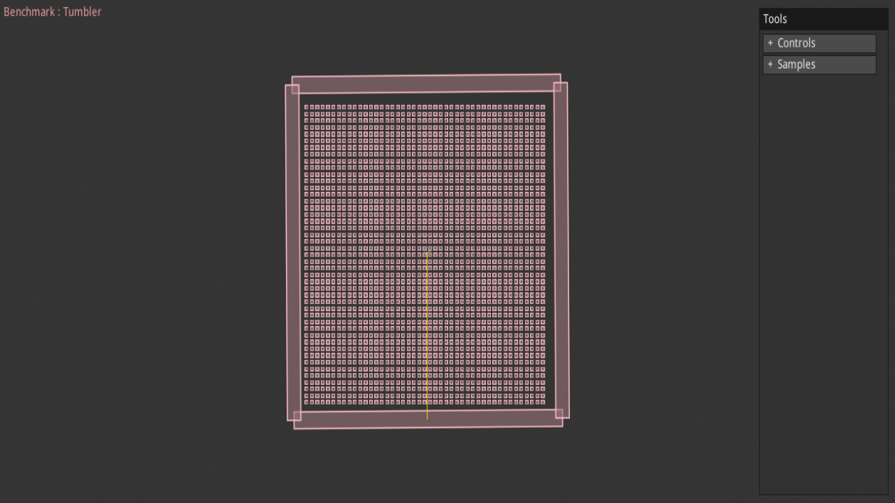

# samples

[](https://dhannyell.github.io/dbox2d/)

**Live demo: [fixed mode](https://dhannyell.github.io/dbox2d/) · [float mode](https://dhannyell.github.io/dbox2d/?mode=float)** — the browser host on GitHub Pages, built from `main` by `pages.yml`. It needs a browser with WebGPU. `?mode=float` picks the float build; the tab title names the mode that runs.

The sample scenes of Box2D v3.1.1, ported to `dbox2d`. A scene builds a
world, steps it and asks the world to draw itself. A host renders the
draw commands with WebGPU and feeds the mouse and the keyboard back. Two
hosts share the same app: a native window and a browser page.

This is its own Go module. It depends on `dbox2d` through a `replace` to
the parent directory, so a change in the solver shows up here at once.

## Run the native host

The native host needs cgo, a C toolchain and a GPU driver with Vulkan,
Metal or D3D12.

```bash
cd samples && go run ./cmd/native
cd samples && go run -tags dbox2d_float ./cmd/native
```

## Test

```bash
cd samples && go test ./...
cd samples && go test -tags dbox2d_float ./...
```

## Run the browser host

The browser host needs a browser with WebGPU. Build the wasm binary into
`web/` and serve that directory. `cmd/serve` is a static file server that
sends `.wasm` with the right content type; any other static server works.

```bash
cd samples && CGO_ENABLED=0 GOOS=js GOARCH=wasm go build -tags fixed_nosatcounter -o web/app.wasm ./cmd/web
cd samples && CGO_ENABLED=0 GOOS=js GOARCH=wasm go build -tags dbox2d_float -o web/app-float.wasm ./cmd/web
```

The page loads `app.wasm` by default and `app-float.wasm` with `?mode=float`.

```bash
cd samples && go run ./cmd/serve
```

Then open `http://localhost:8080`. The `fixed_nosatcounter` tag drops the
saturation counter of `fixed`; the bits are the same and the scalar methods
inline on WebAssembly. The published page builds with it.

## Keys

| Key | Action |
|---|---|
| `[` / `]` | previous / next scene |
| `R` | restart the scene |
| `P` | pause |
| `O` | single step |
| arrows | pan the camera |
| `Home` | reset the camera |
| `Tab` | hide or show the UI |
| left drag | grab a body with a mouse joint |
| right drag / wheel | pan / zoom |

Some scenes read their own keys; the scene draws a hint at the top left.

## Add a scene

A scene is a struct that embeds `Base` and satisfies `Sample`. The
constructor builds the world; `Step` runs the shared step first. Register
it in an `init` under its category and it appears in the menu.

```go
type Pendulum struct {
	Base
}

func NewPendulum(ctx *SampleContext) Sample {
	s := &Pendulum{Base: NewBase(ctx)}
	if !ctx.Settings.Restart {
		ctx.Camera.Center = Vec2f{X: 0, Y: 5}
		ctx.Camera.Zoom = 10
	}
	// Create the ground, the bodies and the joints here.
	return s
}

func (s *Pendulum) Step() {
	s.Base.Step()
}

func init() {
	RegisterSample("Joints", "Pendulum", NewPendulum)
}
```

The port keeps the reference conventions with three changes. Every
simulation value is a `dbox2d.Q`; write constants with
`dbox2d.QMustParse("0.35")` or `dbox2d.QFromRatio(1, 8)`. Every angle is a
turn, not a radian: `π/2` is `1/4`; a motor speed in rad/s goes through
`radiansToTurns`. GUI sliders hold a `float64` and convert with
`FromFloat64` when the value enters the world.

## Scenes

**Stacking** (10): Single Box, Tilted Stack, Vertical Stack, Circle Stack,
Capsule Stack, Cliff, Arch, Double Domino, Confined, Card House.

**Benchmark** (16): Barrel, Tumbler, Many Tumblers, Large Pyramid, Many
Pyramids, CreateDestroy, Sleep, Joint Grid, Smash, Compound, Kinematic,
Cast, Spinner, Rain, Shape Distance, Sensor.

**Joints** (21): Distance Joint, Motor Joint, Filter Joint, Revolute,
Prismatic, Wheel, Bridge, Ball & Chain, Cantilever, Fixed Rotation,
Breakable, Separation, User Constraint, Driving, Ragdoll, Soft Body,
Doohickey, Scissor Lift, Gear Lift, Door, Scale Ragdoll.

**Bodies** (6): Body Type, Weeble, Sleep, Bad, Pivot, Kinematic.

**Character** (1): Mover.

**Collision** (9): Shape Distance, Dynamic Tree, Ray Cast, Cast World,
Overlap World, Manifold, Smooth Manifold, Shape Cast, Time of Impact.

**Continuous** (15): Bounce House, Bounce Humans, Chain Drop, Chain Slide,
Segment Slide, Skinny Box, Ghost Bumps, Speculative Fallback, Speculative
Sliver, Speculative Ghost, Pixel Imperfect, Restitution Threshold, Drop,
Pinball, Wedge.

**Determinism** (1): Falling Hinges.

**Events** (7): Sensor Funnel, Sensor Bookend, Foot Sensor, Contact, Platformer,
Body Move, Sensor Types.

**Geometry** (1): Convex Hull.

**Robustness** (6): HighMassRatio1, HighMassRatio2, HighMassRatio3, Overlap
Recovery, Tiny Pyramid, Cart.

**Shapes** (16): Chain Shape, Compound Shapes, Filter, Custom Filter,
Restitution, Friction, Rolling Resistance, Conveyor Belt, Tangent Speed,
Modify Geometry, Chain Link, Rounded, Ellipse, Offset, Explosion, Recreate
Static.

**World** (1): Large World.

The scenes produce the same bits with any worker count.

## Layout

| Directory | Role |
|---|---|
| `.` | the scenes, `Sample`, `Base`, the camera, the settings, the registry |
| `internal/app` | the app loop, the menu, the settings panel, the profile overlay, input routing |
| `internal/draw` | the draw batches and the WGSL shaders |
| `internal/gpu`, `internal/render` | the WebGPU pipelines |
| `internal/host/native` | GLFW window and surface |
| `internal/host/wasm` | canvas, `requestAnimationFrame` and DOM events |
| `web` | the page, `wasm_exec.js`, the screenshot and the built `app.wasm` and `app-float.wasm` (ignored) |
| `internal/microui` | vendored copy of `zeozeozeo/microui-go` v1.0.1 (Unlicense) |
| `cmd/native`, `cmd/web`, `cmd/serve` | the two hosts and the static server |
